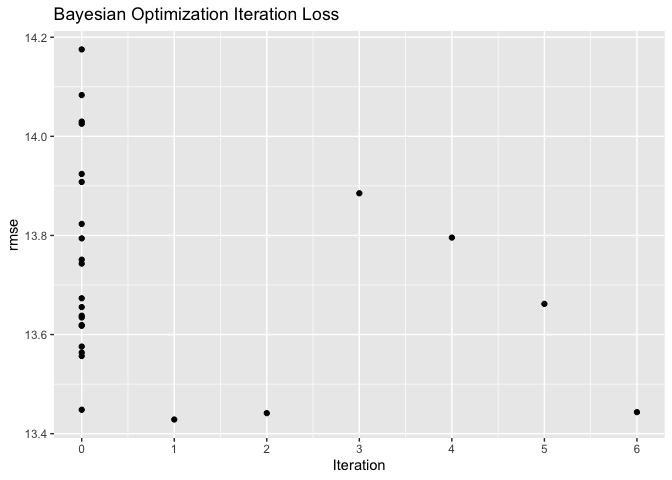
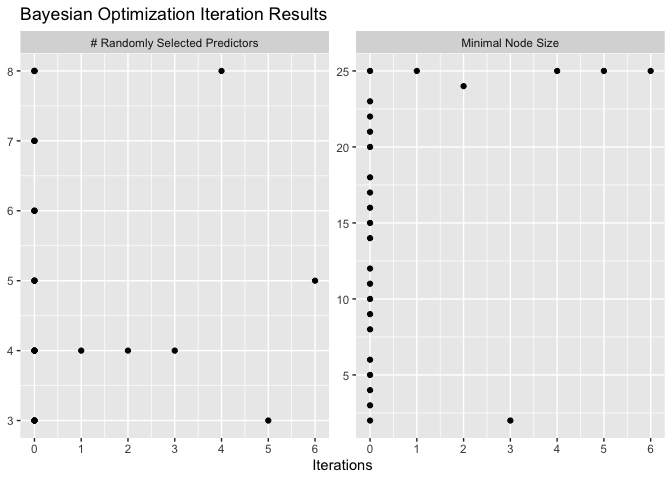
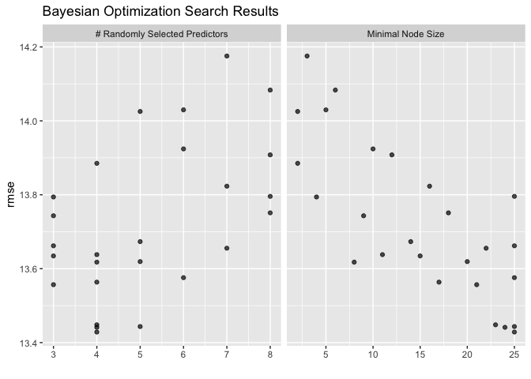
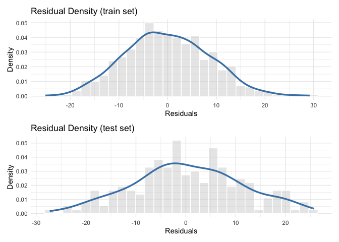
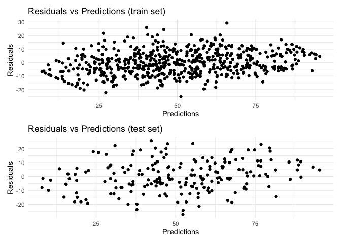

<!-- README.md is generated from README.Rmd. Please edit that file -->

# MLwrap

A minimal library specifically designed to make the estimation of
Machine Learning (ML) techniques as easy and accessible as possible,
particularly within the framework of the Knowledge Discovery in
Databases (KDD) process in data mining. The package provides all the
essential tools needed to efficiently structure and execute each stage
of a predictive or classification modeling workflow, aligning closely
with the fundamental steps of the KDD methodology, from data selection
and preparation, through model building and tuning, to the
interpretation and evaluation of results using Sensitivity Analysis. The
‘MLwrap’ workflow is organized into four core steps; preprocessing(),
build_model(), fine_tuning(), and sensitivity_analysis(). These steps
correspond, respectively, to data preparation and transformation, model
construction, hyperparameter optimization, and sensitivity analysis. The
user can access comprehensive model evaluation results including fit
assessment metrics, plots, predictions, and performance diagnostics for
ML models implemented through Neural Networks, Support Vector Machines,
Random Forest, and XGBoost algorithms. By streamlining these
phases,‘MLwrap’ aims to simplify the implementation of ML techniques,
allowing analysts and data scientists to focus on extracting actionable
insights and meaningful patterns from large datasets, in line with the
objectives of the KDD process.

## Installation

You can install the development version of MLwrap from
[GitHub](https://github.com/) with:

``` r
# install.packages("pak")
pak::pak("AlbertSesePsy/MLwrap")
```

## Example

This is a basic example which shows you how to solve a common problem:

``` r
library(MLwrap)
#> 
#> *****************************************************************************
#> 
#> ooo        ooooo ooooo
#>  88.       .888   888
#>  888b     d 888   888         oooo oooo    ooo oooo d8b  .oooo.   oo.ooooo.
#>  8 Y88. .P  888   888           88.  88.  .8    888 8P  P  )88b   888   88b
#>  8   888    888   888            88..]88..8     888      .oP 888   888   888
#>  8    Y     888   888       o     888  888      888     d8(  888   888   888
#> o8o        o888o o888ooooood8      8    8      d888b     Y888  8o  888bod8P
#>                                                                    888
#>                                                                   o888o
#> 
#> *****************************************************************************
#> 
#>       MLwrap v0.2.3: **Start simple, scale smart**
#> 
## basic example code

formula_reg <- "psych_well ~ age + gender + socioec_status + emot_intel + depression"

analysis_object <- preprocessing(sim_data, formula_reg, task = "regression") |>

                   build_model(model_name = "Random Forest",
                                       hyperparameters = list(trees = 150)) |>

                   fine_tuning(tuner = "Bayesian Optimization", metrics = "rmse") |>
   
                   sensitivity_analysis(methods = c("PFI", "SHAP"), 
                                        metric = "rsq")
                                        
### Tuning Results

analysis_object |>
  plot_tuning_results()
```



``` r

### Evaluation Plots

analysis_object |>
  plot_residuals_distribution() |>
  plot_scatter_residuals() 
```



``` r

### Sensitivity analysis

analysis_object |>
  plot_pfi() |>
  plot_shap()

table_pfi <- table_pfi_results(analysis_object)

show(table_pfi)
$PFI
# A tibble: 8 × 3
  Feature               Importance    StDev
  <chr>                      <dbl>    <dbl>
1 depression             0.666     0.0151  
2 emot_intel             0.110     0.0186  
3 socioec_status_Medium  0.00168   0.00137 
4 gender_Female          0.000636  0.000745
5 socioec_status_Low     0.000486  0.00121 
6 socioec_status_High    0.000148  0.000787
7 age                   -0.0000825 0.00474 
8 gender_Male           -0.000400  0.000694
```
